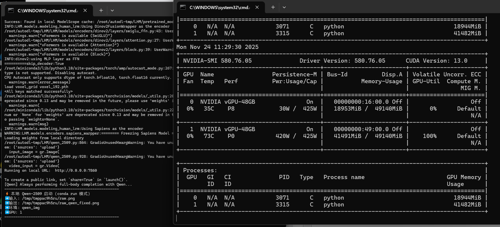
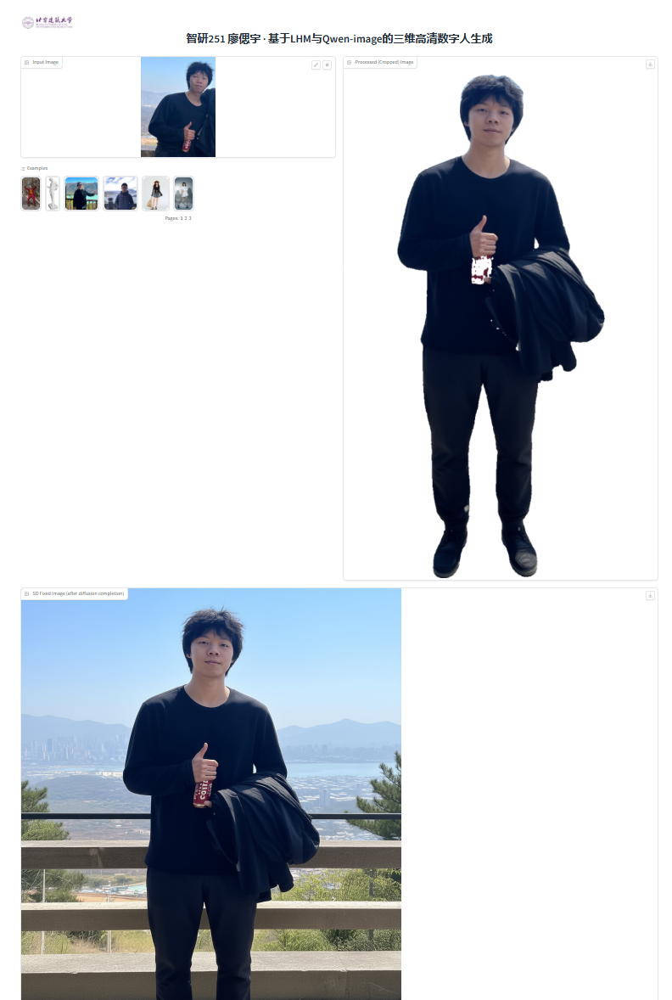
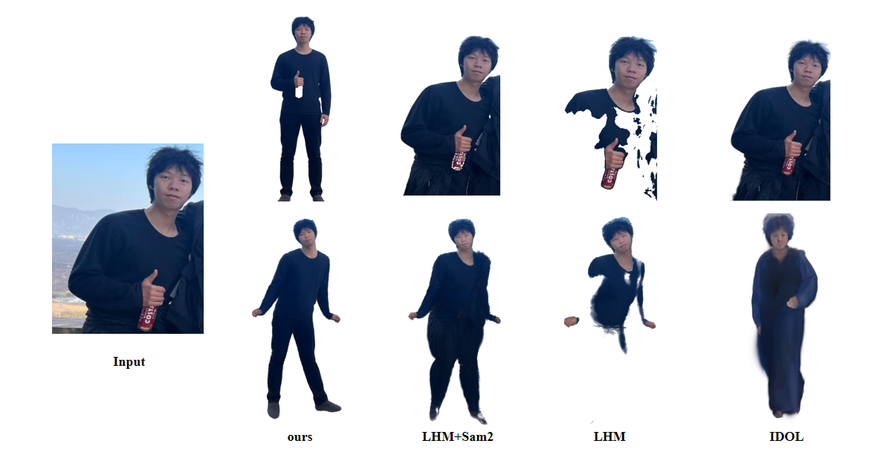
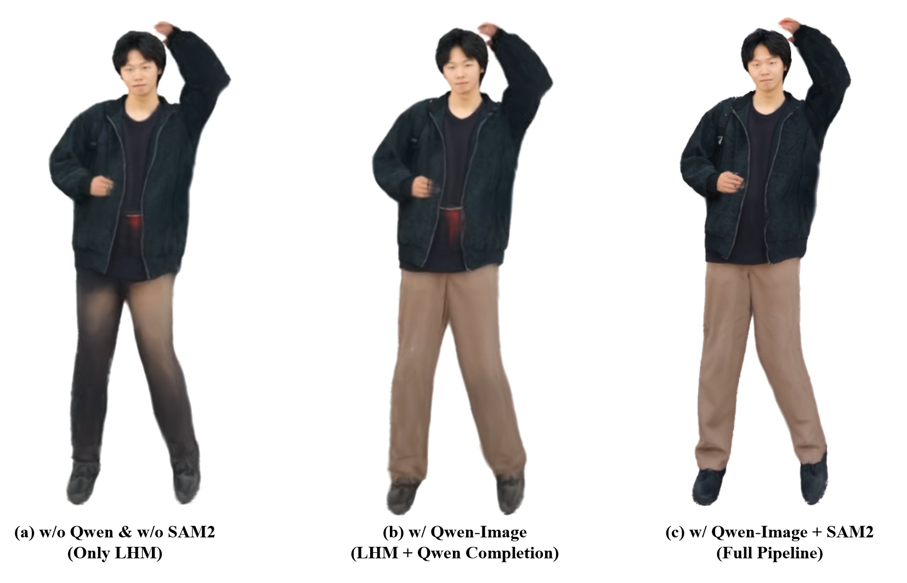

<h1 align="center">
  
  <br>
  基于 LHM 与 Qwen 模型的三维数字人生成 
</h1>

<p align="center">
  <strong>SiYu Liao<sup>*</sup></strong><br>
  北京建筑大学
</p>

[](https://github.com/2179888515junjie/LHM-Qwen-image-edit-2509-Course-Design-Assignment)


## 📢 最新动态
**[2025年11月24日]** 我开始了这个课设 readme 的编写<br>
**[2025年11月23日]** 我成功完成了本地 Qwen-Image-Edit-2059 模型部署以及分布基于2块48G显存GPU生成代码<br>
**[2025年11月19日]** 我成功完成了基于 Qwen-Image API 接口调用模型 LHM 生成代码<br>


## ⚙️ 环境配置

本项目基于 **两个独立虚拟环境**（`LHM_base` 与 `qwen_img`），原因：

- **LHM 模型依赖旧版 diffusers / accelerate / mmcv / pytorch3d**
- **Qwen-Image-Edit-2509 本地推理依赖最新 diffusers / transformers / accelerate**
- 两者依赖强冲突，因此必须分环境运行。

此外，由于 **Qwen-Image-Edit-2509 本地模型体量巨大（≈57 GB）**，需要高显存 GPU 支持。

本项目实际运行环境如下：

### 🖥️ 硬件环境（AutoDL 云端）
| 设备 | 型号 | 显存 | 数量 |
|------|------|------|------|
| GPU | NVIDIA vGPU-48GB | 49 GB | 2 张 |
| CUDA 版本 | CUDA 13.0 | - | 驱动 580.76.05 |
| CPU | AutoDL 默认配置 | - | - |
| 系统 | Ubuntu 20.04 / Miniconda | - | - |
> 💡 **说明：**  
>由于基于Autodl，代码中部分路径包含Autodl-tmp，可以按需更改文件名  
> LHM-1B / LHM-500M 在本机两张 48GB GPU 上均可稳定运行；  
> Qwen-Image-Edit-2509（本地版）推理需要单卡至少 **48GB 显存** 才能完全加载模型。
> 采用本地推理时占用显存数据如下图所示
  

  

1.克隆仓库
```bash
git clone https://github.com/2179888515junjie/LHM-Qwen-image-edit-2509-Course-Design-Assignment
cd LHM-Qwen-image-edit-2509-Course-Design-Assignment

```

2.创建环境1：LHM_base（主环境）  
  
 此环境用于运行：  
> LHM 模型（1B / 500M）  
> SAM2 分割  
> 视频解析（Video2MotionPipeline）  
> 3DGS 重建与渲染  
 
**创建环境**
```
conda create -n LHM_base python=3.10
conda activate LHM_base
```

安装 LHM 依赖（适配 CUDA 11.8）

```
# CUDA 11.8 环境
sh ./install_cu118.sh
pip install rembg

或 CUDA 12.x：

# cuda 12.1
sh ./install_cu121.sh
pip install rembg
```
本环境使用的关键库版本：

> torch==2.3.0+cu118  
> diffusers==0.36.0.dev0  
> mmcv / mmpose / pytorch3d  
> SAM2 (pip install sam-2)  
> accelerate==0.25  
> numpy==1.23.5

此环境已经过 48GB GPU、CUDA 11.8 实测验证，可稳定运行 LHM Pipeline。


3.创建环境2：qwen_img（用于本地 Qwen-Image-Edit-2509 推理）

**创建环境**  
<span style="color:yellow">强烈建议采用 Qwen 官方推荐的 diffusers</span>

```
conda create -n qwen_img python=3.10
conda activate qwen_img
```

安装 Qwen-Image-Edit-2509 推理所需依赖：
```
pip install torch==2.4.0+cu118 torchvision==0.19.0+cu118 --extra-index-url https://download.pytorch.org/whl/cu118

# 最新 diffusers（Qwen 所要求）
pip install git+https://github.com/huggingface/diffusers

# transformers / accelerate
pip install transformers accelerate

pip install safetensors pillow
```
**若出现"TypeError: scaled_dot_product_attention() got an unexpected keyword argument 'enable_gqa'"报错**  
如果不想改环境版本的话，可以打个补丁，暂时禁用参数： 
> import torch.nn.functional as F
> original_scaled_dot_product_attention = F.scaled_dot_product_attention  
> def patched_scaled_dot_product_attention(*args, **kwargs):  
> 移除 enable_gqa 参数  
> kwargs.pop('enable_gqa', None)  
> return original_scaled_dot_product_attention(*args, **kwargs)   
> F.scaled_dot_product_attention = patched_scaled_dot_product_attention


### LHM模型下载 


<span style="color:red">如果你没下载模型，模型将会自动下载</span>


| 模型 | 训练数据 | Transformer 层数| ModelScope| HuggingFace| 推理时间 | 要求输入|
| :--- | :--- | :--- | :--- | :--- | :--- |:--- |
| LHM-MINI | 300K 视频数据 + 5K 3D数据  | 2 | [ModelScope](https://modelscope.cn/models/Damo_XR_Lab/LHM-MINI) |[huggingface](https://huggingface.co/3DAIGC/LHM-MINI)| 1.41 s | 全身半身|
| LHM-500M | 300K 视频数据 + 5K 3D数据  | 5 | [ModelScope](https://modelscope.cn/models/Damo_XR_Lab/LHM-500M) |[huggingface](https://huggingface.co/3DAIGC/LHM-500M)| 2.01 s | 全身|
| LHM-500M-HF | 300K 视频数据 + 5K 3D数据 | 5 | [ModelScope](https://modelscope.cn/models/Damo_XR_Lab/LHM-500M-HF) |[huggingface](https://huggingface.co/3DAIGC/LHM-500M-HF)| 2.01 s | 全身半身|
| LHM-1.0B | 300K 视频数据 + 5K 3D数据 | 15 | [ModelScope](https://modelscope.cn/models/Damo_XR_Lab/LHM-1B) |[huggingface](https://huggingface.co/3DAIGC/LHM-1B)| 6.57 s | 全身|
| LHM-1B-HF | 300K 视频数据 + 5K 3D数据  | 15 | [ModelScope](https://modelscope.cn/models/Damo_XR_Lab/LHM-1B-HF) |[huggingface](https://huggingface.co/3DAIGC/LHM-1B-HF)| 6.57 s |全身半身|


#### 从HuggingFace下载
```python
from huggingface_hub import snapshot_download 
# MINI Model
model_dir = snapshot_download(repo_id='3DAIGC/LHM-MINI', cache_dir='./pretrained_models/huggingface')
# 500M-HF Model
model_dir = snapshot_download(repo_id='3DAIGC/LHM-500M-HF', cache_dir='./pretrained_models/huggingface')
# 1B-HF Model
model_dir = snapshot_download(repo_id='3DAIGC/LHM-1B-HF', cache_dir='./pretrained_models/huggingface')
```

### 下载先验模型权重
```bash
# 下载先验模型权重
wget https://virutalbuy-public.oss-cn-hangzhou.aliyuncs.com/share/aigc3d/data/LHM/LHM_prior_model.tar 
tar -xvf LHM_prior_model.tar 
```

### 动作数据准备
LHM 提供了测试动作示例：
```bash
# 下载先验模型权重
wget https://virutalbuy-public.oss-cn-hangzhou.aliyuncs.com/share/aigc3d/data/LHM/motion_video.tar
tar -xvf ./motion_video.tar 
```

下载完成后LHM文件结构如下：
```bash
├── configs
│   ├── inference
│   ├── accelerate-train-1gpu.yaml
│   ├── accelerate-train-deepspeed.yaml
│   ├── accelerate-train.yaml
│   └── infer-gradio.yaml
├── engine
│   ├── BiRefNet
│   ├── pose_estimation
│   ├── SegmentAPI
├── example_data
│   └── test_data
├── exps
│   ├── releases
├── LHM
│   ├── datasets
│   ├── losses
│   ├── models
│   ├── outputs
│   ├── runners
│   ├── utils
│   ├── launch.py
├── pretrained_models
│   ├── dense_sample_points
│   ├── gagatracker
│   ├── human_model_files
│   ├── sam2
│   ├── sapiens
│   ├── voxel_grid
│   ├── arcface_resnet18.pth
│   ├── BiRefNet-general-epoch_244.pth
├── scripts
│   ├── exp
│   ├── convert_hf.py
│   └── upload_hub.py
├── tools
│   ├── metrics
├── train_data
│   ├── example_imgs
│   ├── motion_video
├── inference.sh
├── README.md
├── requirements.txt
```

### Qwen-Image-Edit-2509模型下载 
```python
from huggingface_hub import snapshot_download

# Qwen-Image-Edit-2509（完整版模型，约 57GB）
model_dir = snapshot_download(
    repo_id='Qwen/Qwen-Image-Edit-2509',
    cache_dir='./pretrained_models/Qwen-Image-Edit-2509'
)
```

下载完成后Qwen-Image-Edit-2509模型文件结构如下：
```bash
Qwen-Image-Edit-2509
├── processor
│   ├── added_tokens.json
│   ├── chat_template.jinja
│   ├── merges.txt
│   ├── preprocessor_config.json
│   ├── special_tokens_map.json
│   ├── tokenizer.json
│   ├── tokenizer_config.json
│   ├── video_preprocessor_config.json
│   └── vocab.json
│
├── scheduler
│   └── scheduler_config.json
│
├── text_encoder
│   ├── config.json
│   ├── generation_config.json
│   ├── model.safetensors.index.json
│   ├── model-00001-of-00004.safetensors   # 4.97 GB
│   ├── model-00002-of-00004.safetensors   # 4.99 GB
│   ├── model-00003-of-00004.safetensors   # 4.93 GB
│   └── model-00004-of-00004.safetensors   # 1.69 GB
│
├── tokenizer
│   ├── added_tokens.json
│   ├── chat_template.jinja
│   ├── merges.txt
│   ├── special_tokens_map.json
│   ├── tokenizer_config.json
│   └── vocab.json
│
├── transformer
│   ├── config.json
│   ├── diffusion_pytorch_model.safetensors.index.json
│   ├── diffusion_pytorch_model-00001-of-00005.safetensors   # 9.97 GB
│   ├── diffusion_pytorch_model-00002-of-00005.safetensors   # 9.99 GB
│   ├── diffusion_pytorch_model-00003-of-00005.safetensors   # 9.99 GB
│   ├── diffusion_pytorch_model-00004-of-00005.safetensors   # 9.93 GB
│   └── diffusion_pytorch_model-00005-of-00005.safetensors   # 0.98 GB
│
├── vae
│   ├── config.json
│   └── diffusion_pytorch_model.safetensors   # 254 MB
│
├── model_index.json
├── .gitattributes
└── README.md
```

## 📃 文件路径

>请保持路径和下面一致  
>模型本身内容进行省略
>主要工作文件已经由✅️标出
```bash
Autodl-tmp
├── LHM                                  # 🟩 本课设的主工程
│   ├── qwen_2509.py                     # ✅️ Qwen 本地调用脚本
│   ├── Qwen_API.py                      # ✅️ Qwen API版本
│   ├── bucea.jpg                        # BUCEA Logo
│   ├── requirements.txt
│   ├── LICENSE
│   ├── README.md
│   │
│   ├── LHM                              # LHM 核心代码
│   │   ├── datasets
│   │   ├── losses
│   │   ├── models
│   │   ├── runners
│   │   ├── utils
│   │   └── launch.py
│   │
│   ├── engine                     
│   │   ├── BiRefNet                     #若未采用Sam则使用BiRefNet
│   │   ├── pose_estimation
│   │   └── SegmentAPI                   # SAM2 相关
│   │
│   ├── pretrained_models                # 所有模型权重
│   │   ├── Damo_XR_Lab
│   │   ├── 3DAIGC
│   │   ├── sam2
│   │   ├── gagatracker
│   │   ├── sapiens
│   │   ├── human_model_files
│   │   └── voxel_grid
│   │
│   ├── train_data                       # 输入图片 / 动作视频
│   │   ├── example_imgs
│   │   └── motion_video
│   │
│   ├── outputs
│   │   ├── ply                          # 生成的 3D Gaussian PLY
│   │   └── ...
│   │
│   ├── configs
│   ├── scripts
│   └── tools
│
│
├── Qwen-Image-Edit-2509                 # 🟦 本地 Qwen 模型（57GB）
│   ├── Qwen_inpaint.py                  # ✅️ 本地生图入口，被 LHM 调用
│   ├── processor/
│   ├── scheduler/
│   ├── text_encoder/
│   ├── tokenizer/
│   ├── transformer/
│   ├── vae/
│   └── model_index.json
│
│
├── sam2-main/                           # SAM2 官方仓库（用于 Segment）
├── diffusers-main/                      # HuggingFace diffusers 全仓库
├── pytorch3d-main/                      # PyTorch3D（LHM 依赖）
├── BasicSR-master/
├── CLIP-main/
├── diff-gaussian-rasterization-main/
├── qwen_image_edit_api.py               # ✅️ 调用API脚本，请输入自己的API
└── tools/
```
## 💻 本地部署 
我们现在支持用户调用阿里 Qwen-Image API来生成图片，只需要用户在"qwen_image_edit_api.py"文件中，写入自己的APIkey。  
申请链接：https://cn.aliyun.com/product/tongyi?from_alibabacloud=&utm_content=se_1021898286
```bash
# 调用Qwen_API生成图片
python ./Qwen_API.py 
# 调用本地Qwen模型生成图片
python ./Qwen_2509.py  
```

## 👀 效果与展示
下图为运行 Qwen_API.py   
基于Qwen-Image API 生成的图片与经过 Sam2 分割后的结果
  


下图为运行 Qwen_2509.py
基于Qwen-Image-Edit-2509 生成的图片与经过 Sam2 分割后的结果
  
  
  
可以看到，采用了扩散模型对原本输入文件进行预处理后，效果明显提升了  
下图为对比实验  
  

  
  
可以看到采用了 Qwen 模型之后的生成质量是最高的  


下图为消融实验  
  
    
  
  可以看到采用 Sam2 + Qwem模型 进行分割与预处理的效果是最佳的


## 🤔 展望
其实可以发现，本任务的初衷是想优化 LHM 生成3D数字人的鲁棒性  
本实验其实还做了基于sdv-1.5扩散模型的尝试，但是效果实属不佳  
在引入了 Qwen-Image-Edit-2509 的情况下，实验的生成效果大幅提升，但同时也带来了不足  
① 生成时间增长  
② 占用显存较高  
未来的研究可以考虑一个性能与代价均衡的方式将输入的图片优化  


## 致谢

本工作基于以下优秀研究成果和开源项目构建：

- [LHM](https://github.com/aigc3d/LHM)
- [IDOL](https://yiyuzhuang.github.io/IDOL/)
